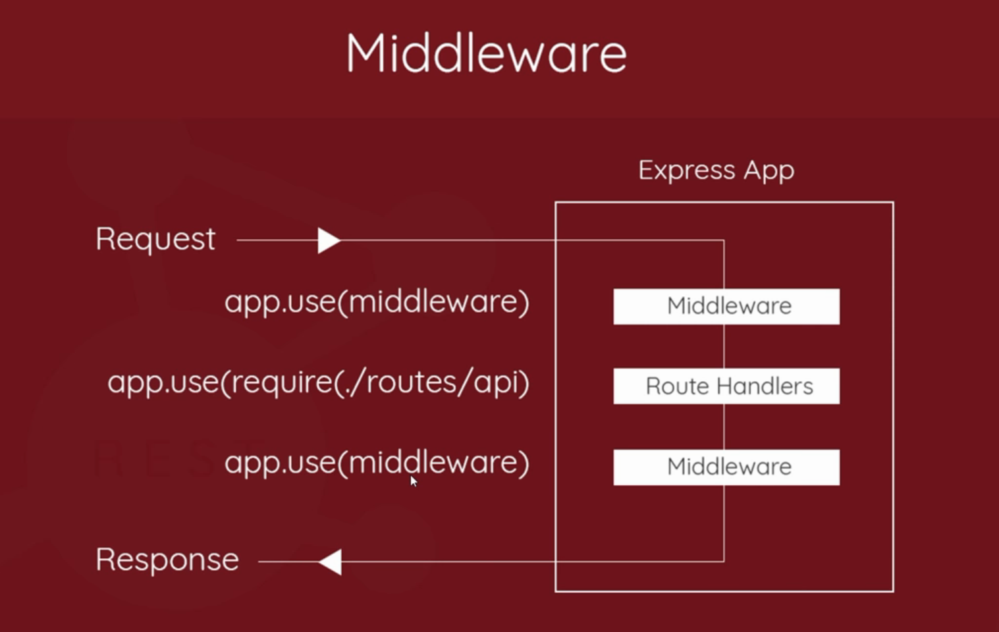

## Express Tutorial
- By The Net Ninja

#### HTTP Requests
By using the express commands for CRUD,


```javascript
app.post('route', (req, res) => {cb}); // C
app.get('route', (req, res) => {cb}); // R
app.put('route', (req, res) => {cb}); // U
app.delete('route', (req, res) => {cb}); // D
```

#### Express Routes

```javascript
const router = express.Router();

// get a list of ninjas from db
router.get('/ninjas', (req, res) => {
  res.send({type: 'GET'});
});

// add a new ninja to db
router.post('/ninjas', (req, res) => {
  res.send({type: 'POST'});
});

// update a ninja from the db
router.put('/ninjas/:id', (req, res) => {
  res.send({type: 'PUT'});
});

// delete a ninja from db
router.delete('/ninjas', (req, res) => {
  res.send({type: 'DELETE'});
});

module.exports = router;
```

and in our index.js

```javascript
const routes = require('./routes/api');
// app.use for adding middleware
app.use('/api', routes);
```

#### POST Requests
For creating new data.
Use the `body-parser` npm package.

```javascript
const bodyParser = require('body-parser');
app.use(bodyParser.json());
```

##### Middleware



Added using the `app.use(middleware)` commands.

#### Models

Represent collections

* User model to represent collection of Users
* Ninja model to represent collection of Ninjas

##### Mongoose

* Provides a layer of methods to CRUD data in `mongodb`.
* Provides a way to create models and schemas.

```javascript
const mongoose = require('mongoose');
const Schema = mongoose.Schema;

const NinjaSchema = new Schema({
  name: {
    type: String,
    required: [true, "name field required!"]
  },
  rank: {
    type: String
  },
  available: {
    type: Boolean,
    default: false
  }
  // add in geo location
})

const Ninja =mongoose.model('ninja', NinjaSchema);

module.exports = Ninja;
```

##### Saving data to Mongodb
